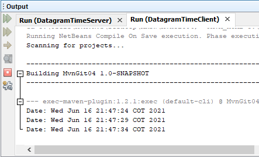

## Datagram - HTTP Server
### Miguel Ángel Rodríguez Siachoque
### 16 de Junio de 2021

### Paquete Datagram
 
#### Descripción de DatagramTimeCliente.java
Este programa se encarga de enlazar el servidor de datagramas con un cliente.
#### Descripción de DatagramTimeServer.java
Este es un programa donde se genera el servidor que recibe y envia la hora y fecha actual con un tiempo de 5 segundos de diferencia.
#### Ejecución
> 1. Ejecución de ___DatagramTimeServer.java___
> 2. Ejecución de ___DatagramTimeCliente.java___
> 3. La salida será automatica, por lo que este servidor actualizará el tiempo cuando los dos progrmas esten ejecutados.
> > El cliente seguira actualizando la hora aunque el servidor se encuentre apagado.

### Paquete ServerWeb
 
#### Descripción de HttpServer.java
Este programa genera un servidor que ejecuta los archivos que se encuentran en el proyecto, tales como ___html, Css, Js e imagenes___.
#### Descripción de ThreadPoolExcecutor.java
Este programa genera los hilos que necesita el servidora para ejecutar multiples ventanas o funciones.
#### Ejecución
> 1. Ejecución de ___ThreadPoolExcecutor.java___
> 2. Abrir su navegador e ir ___http://127.0.0.1:35000/___ + ___archivo___
> 3. La salida será el archivo ejecutado en el navegador.
> > ___HttpServer.java___ no es necesario ser ejecutado.

## Test
### Paquete Datagram
 
- Se comprueba El funcionamiento de la hora mientras funciona el Servidor.

 
- Se comprueba El funcionamiento de la hora mientras no funciona el Servidor.
### Paquete ServerWeb
 
- Las pruebas de HttpServer se verifican entrando en http://127.0.0.1:35000/TestHttpServer1.html, http://127.0.0.1:35000/TestHttpServer2.html ó http://127.0.0.1:35000/TestHttpServer3.html .
> Las tres pruebas pueden ser ejecutadas al mismo tiempo para comprobar los hilos.

## JavaDoc:
[JavaDoc - Datagram - HTTP Server](JavaDoc/index.html)

## Tiempo de Lineas LOC:
- ___El archvivo HttpServer.java:___ 
106 + 36(Test) = 99 lineasLOC. 
- ___El archvivo ThreadPoolExcecutor.java:___ 
16 lineasLOC. 
- ___El archvivo DatagramTimeServer.java:___ 
54 lineasLOC. 
- ___El archvivo DatagramTimeClient.java:___ 
35 lineasLOC. 
### Tiempo total:
___211/7 = 30.14 lineasLOC/hora.___